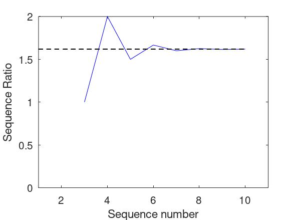
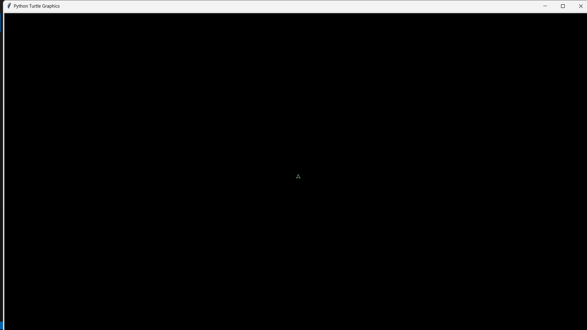

# Fibonacci Sequence Calculator
This python code calculates the Fibonacci sequence up to a specified term and visualizes the results.

## Usage
```python
% Example Usage:
n = 10; % Replace with desired term
fib, ratio = fibonacci(n)
```
```bash
fib_sequence =

    0    1    1    2    3    5    8   13   21   34

```

## Visualization
The function generates two plots:

- The Fibonacci sequence and the cumulative Fibonacci sequence.

- The ratio of consecutive Fibonacci numbers and a reference line for the golden ratio (approximately 1.618034).



## Fibonacci Spiral Drawer
The Python script extends the previously provided Fibonacci sequence calculator by incorporating a function to draw the Fibonacci sequence using the Turtle graphics library.

